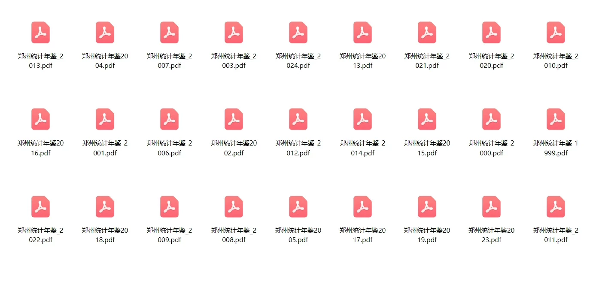
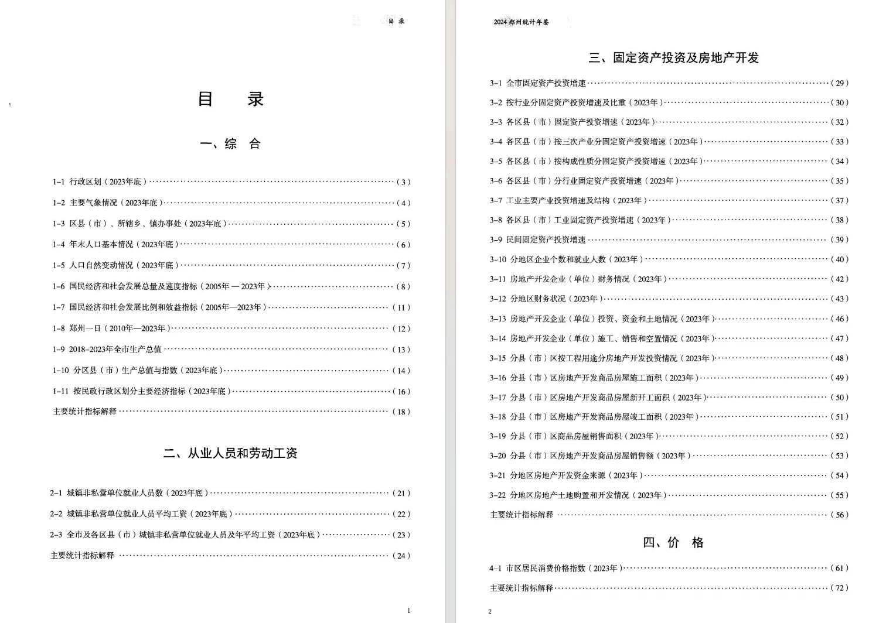
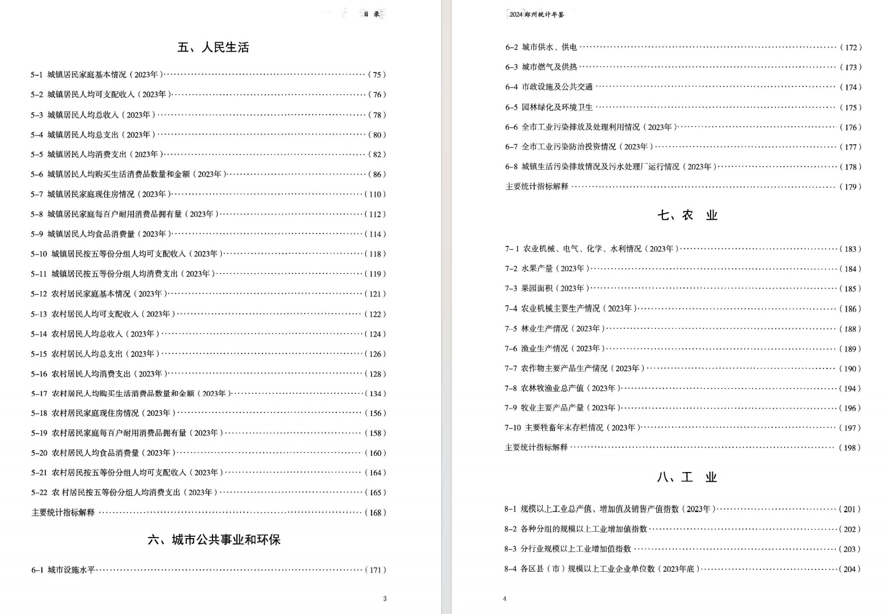
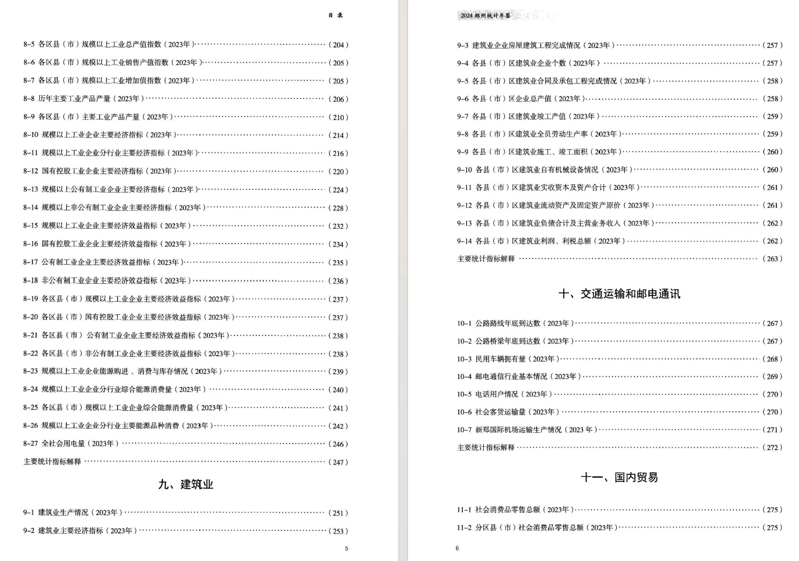
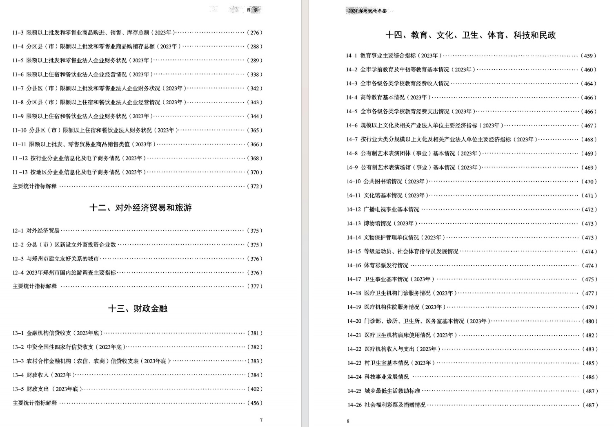
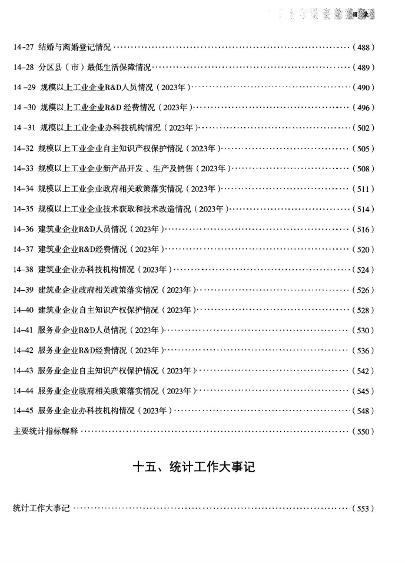

## Body

Zhengzhou Statistical Yearbook (1999-2024)

Data Year: The yearbook covers the years from 1999 to 2024. (The data year should be one less than the yearbook year).

01. Data Introduction
"Zhengzhou Statistical Yearbook"

02. Indicator Details
The directory is displayed in the image, please view it on your own and purchase accordingly. If you need help finding specific indicators, they are all here. After shipment, we do not support returns without a reason.
The display directory is for the year 2024. Different statistical methods may change over time, and academic knowledge is expected to be known.

03. Data Content
Format: All years are available in PDF format, if you prefer not to buy, please do not purchase.

## Images

item_1072025358253

Here is a pay link on Stripe ( https://buy.stripe.com/3cs8yP7sY87d0vu9AB ). Please contact me lonlonago@foxmail.com after funding $89, and I will send you a complete data files , thank you!

